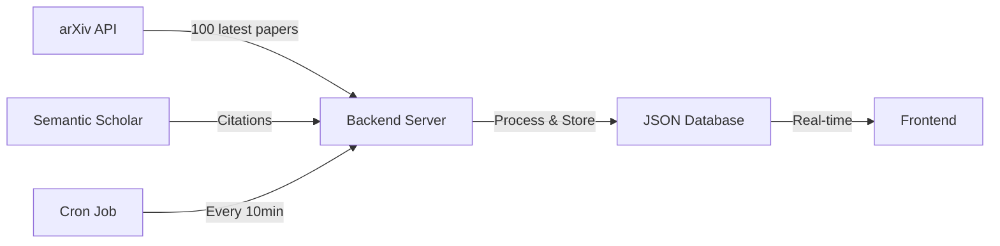

# 🔬 Real-Time Research Papers - Complete System

## 🎉 What's New

Your AI Hub now has a **fully automated research paper aggregation system** that:

✅ Fetches latest AI papers from **Semantic Scholar** every 10 minutes  
✅ Enriches with **Semantic Scholar** citation data  
✅ Categorizes by industry automatically  
✅ Shows real-time research trends  
✅ Updates your feed automatically  

## 🚀 Quick Start (2 Steps)

### Option 1: Automatic (Windows)
```bash
start.bat
```

### Option 2: Automatic (Mac/Linux)
```bash
chmod +x start.sh
./start.sh
```

### Option 3: Manual
```bash
# Terminal 1 - Backend
cd backend
npm install
npm start

# Terminal 2 - Frontend
npm run dev
```

## 📁 What Was Created

```
ai-hub/
├── backend/                    # NEW! Backend server
│   ├── services/
│   │   ├── arxivService.js    # Fetches from arXiv API
│   │   └── semanticScholarService.js  # Citation enrichment
│   ├── server.js              # Express API server
│   ├── package.json           # Backend dependencies
│   └── README.md              # Backend docs
├── src/
│   ├── services/
│   │   └── api.ts             # NEW! Frontend API client
│   └── pages/
│       └── ResearchPapers.tsx # UPDATED! Now uses real API
├── SETUP_RESEARCH_API.md      # Detailed setup guide
└── start.bat / start.sh       # Easy startup scripts
```

## 🎯 How It Works



### Data Flow:

1. **Backend fetches** 100 latest papers from Semantic Scholar (AI topics)
2. **Falls back** to arXiv if needed, then enriches with Semantic Scholar citation counts
3. **Categorizes** by industry (Healthcare AI, Robotics, NLP, etc.)
4. **Stores** in local JSON database
5. **Serves** to frontend via REST API
6. **Auto-refreshes** every 10 minutes (100 papers per update)

## 📊 API Endpoints

### Backend Server (`http://localhost:3001`)

| Endpoint | Method | Description |
|----------|--------|-------------|
| `/api/papers` | GET | Get all papers with filters |
| `/api/papers/stats` | GET | Industry statistics |
| `/api/papers/:id` | GET | Specific paper details |
| `/api/papers/refresh` | POST | Manual refresh trigger |
| `/api/health` | GET | Server health check |

### Example Request:
```bash
curl "http://localhost:3001/api/papers?category=Computer Vision&limit=10"
```

## 🔧 Configuration

### Environment Variables

Create `backend/.env`:
```env
PORT=3001
SEMANTIC_SCHOLAR_API_KEY=your_key_here  # Optional but recommended
REFRESH_INTERVAL_MINUTES=10
```

### Get Semantic Scholar API Key:
1. Visit: https://www.semanticscholar.org/product/api
2. Sign up for free API access
3. Add key to `.env` file

**Note:** Works without API key, but citation data will be limited.

## 🎨 Frontend Features

### New Components:

1. **Real-Time Paper Feed**
   - Live data from arXiv
   - Citation counts
   - PDF links
   - Author information

2. **Industry Activity Stats**
   - Shows which industries have most research
   - Real-time bar charts
   - Clickable categories

3. **Manual Refresh Button**
   - Force immediate update
   - Shows loading state
   - Updates timestamp

4. **Search & Filters**
   - Search by title/author
   - Filter by category
   - Filter by venue
   - Real-time filtering

## 📈 Customization Guide

### Change Update Frequency

In `backend/server.js`:
```javascript
// Every 10 minutes (default)
cron.schedule('*/10 * * * *', updatePapers);

// Every 5 minutes
cron.schedule('*/5 * * * *', updatePapers);

// Every hour
cron.schedule('0 * * * *', updatePapers);
```

### Fetch More Papers

In `backend/server.js`:
```javascript
// Fetch 200 papers from last 14 days
const arxivPapers = await fetchArXivPapers(200, 14);
```

### Add More arXiv Categories

In `backend/services/arxivService.js`:
```javascript
const AI_CATEGORIES = [
  'cs.AI',   // Artificial Intelligence
  'cs.LG',   // Machine Learning
  'cs.CV',   // Computer Vision
  'cs.SE',   // Software Engineering (NEW)
  'cs.DB',   // Databases (NEW)
  // Add more...
];
```

## 🐛 Troubleshooting

### Backend won't start?
```bash
cd backend
rm -rf node_modules package-lock.json
npm install
npm start
```

### Papers not loading?
1. Check backend is running: Open `http://localhost:3001/api/health`
2. Check browser console (F12) for errors
3. Try clicking "Refresh" button
4. Check backend terminal for errors

### CORS errors?
The backend has CORS enabled for all origins. If you still see errors:
- Restart both frontend and backend
- Clear browser cache

### Rate limiting?
arXiv and Semantic Scholar have rate limits:
- arXiv: No strict limit, but be respectful
- Semantic Scholar: 100 requests/5 minutes (with API key)

The backend has built-in delays (100ms between requests).

## 🚀 Production Deployment

### Backend (Railway/Heroku)

1. Push backend folder to git
2. Set environment variables:
   ```
   PORT=3001
   SEMANTIC_SCHOLAR_API_KEY=your_key
   ```
3. Enable worker/cron for auto-refresh

### Frontend (Vercel/Netlify)

1. Update `.env`:
   ```
   VITE_API_URL=https://your-backend.railway.app/api
   ```
2. Build and deploy:
   ```bash
   npm run build
   ```

## 📊 Example Data

### Paper Object:
```json
{
  "id": "2311.12345",
  "arxivId": "2311.12345",
  "title": "Efficient Fine-Tuning of Large Language Models",
  "authors": ["John Doe", "Jane Smith"],
  "summary": "We present a novel approach...",
  "published": "2023-11-20T00:00:00.000Z",
  "link": "https://arxiv.org/abs/2311.12345",
  "pdfLink": "https://arxiv.org/pdf/2311.12345",
  "tags": ["Machine Learning", "NLP", "LLMs"],
  "venue": "arXiv",
  "citations": 42,
  "categories": ["cs.LG", "cs.CL"]
}
```

### Industry Stats:
```json
{
  "Healthcare AI": 15,
  "Computer Vision": 32,
  "NLP": 28,
  "Robotics": 12,
  "Machine Learning": 45
}
```

## 🎓 Learn More

- [arXiv API Documentation](https://arxiv.org/help/api)
- [Semantic Scholar API](https://api.semanticscholar.org)
- [Express.js Documentation](https://expressjs.com)
- [React Query Hooks](https://react.dev/reference/react)

## 📝 TODO / Future Enhancements

- [ ] Add paper recommendations based on user interests
- [ ] Implement paper bookmarking
- [ ] Add email notifications for new papers
- [ ] Create knowledge graph connections
- [ ] Add paper discussion threads
- [ ] Implement full-text search
- [ ] Add author following
- [ ] Create paper collections/playlists

## 💡 Tips

1. **First Load**: Takes ~2 minutes to fetch initial papers
2. **Citation Data**: Requires Semantic Scholar API key for best results
3. **Storage**: Papers stored in `backend/data/papers.json`
4. **Performance**: Backend caches papers in memory for fast API responses
5. **Reliability**: Database persists across restarts

## ✅ Verification Checklist

- [ ] Backend starts without errors
- [ ] Frontend connects to backend
- [ ] Papers load in Research tab
- [ ] Industry stats appear in sidebar
- [ ] Search works
- [ ] Filters work
- [ ] Refresh button works
- [ ] Links to arXiv work

## 🎉 You're All Set!

Your research feed is now powered by real data from Semantic Scholar, updating automatically every 10 minutes with 100 fresh papers!

Navigate to the **Research** tab and explore the latest AI research. 🚀

